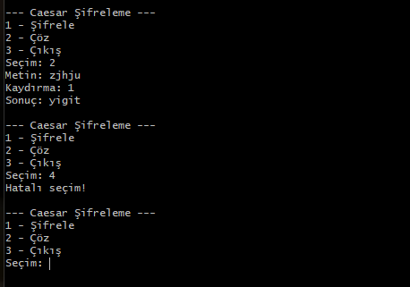

# 🔐 Caesar Şifreleme CLI Uygulaması

## 📌 Proje Hakkında

Bu proje, klasik şifreleme yöntemlerinden biri olan **Caesar Şifreleme Algoritması** kullanılarak geliştirilmiş bir **komut satırı (CLI) uygulamasıdır**.

Uygulama, kullanıcıdan alınan metni belirli bir kaydırma değeri ile şifreler ve aynı yöntemle tekrar çözer.

---

## 🎯 Amaç

Bu projenin amacı:

* Temel şifreleme algoritmalarını öğrenmek
* Algoritma mantığını uygulamalı olarak göstermek
* JavaScript ile CLI (Command Line Interface) uygulaması geliştirmek

---

## ⚙️ Kullanılan Teknolojiler

* JavaScript (Node.js)
* Readline (CLI kullanıcı etkileşimi)

---

## 🚀 Kurulum ve Çalıştırma

### 1. Projeyi klonla

```bash
git clone <repo-link>
cd caesar-cli
```

### 2. Uygulamayı çalıştır

```bash
npm start
```

veya

```bash
node caesar.js
```

---

## 🧠 Algoritma Mantığı

Caesar şifreleme algoritması, metindeki her harfi alfabede belirli bir sayı kadar kaydırarak çalışır.

Örnek:

* Kaydırma: 3
* a → d
* b → e
* z → c

Şifre çözme işlemi ise aynı kaydırmanın ters yönde uygulanmasıyla yapılır.

---

## 🖥️ Kullanım

Program çalıştırıldığında kullanıcıya bir menü sunulur:

```text
1 - Şifrele
2 - Çöz
3 - Çıkış
```

### 🔐 Şifreleme Örneği

```text
Metin: merhaba
Kaydırma: 3
Sonuç: phukded
```

### 🔓 Çözme Örneği

```text
Metin: phukded
Kaydırma: 3
Sonuç: merhaba
```

---

## 📷 Ekran Görüntüsü



---

## ✨ Özellikler

* Büyük/küçük harf desteği
* Harf dışı karakterleri koruma (boşluk, noktalama vb.)
* Basit ve kullanıcı dostu CLI arayüzü


